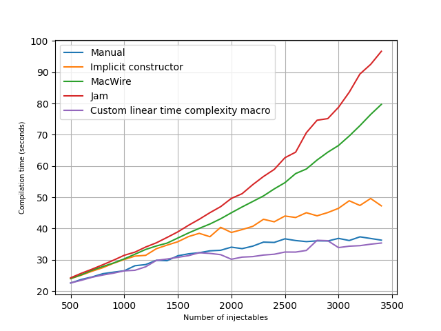

# scala_di_benchmarks
Measuring the time complexity of various methods of dependency injection in Scala.

`scala_di_benchmarks` generates a plot like that below demonstrating the time complexity and compilation time of dependency injection in Scala.
Manual wiring, constructors with implicit parameters, MacWire, and Jam were used.
See `src/*/scala/Main.scala` to understand these approaches.



# How to use

```
$ ./profiler.py
```
